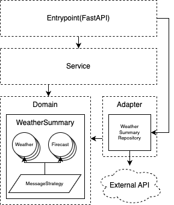

# WeatherBot API
## Requirements
- docker with docker-compose
- a local python virtualenv(python 3.10 recommended)
## Building and run the container
```shell
make build
make up

# checking logs
make logs

# remove containers
make down
```
## Running the tests
```shell
make test
```
## Native environment(python virtualenv)
You need to create a Python virtualenv in advance.
```shell
# You should execute below commands on your local python venv.

# install dependencies
make install

# run tests
make test-native

# run server
make up-native
```
## Diagram(Dependency relationship)
